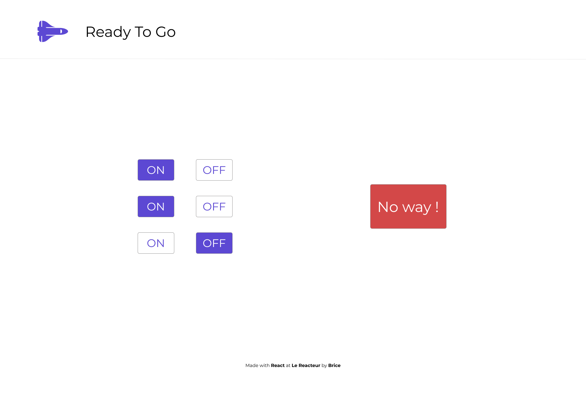

# Ready To Go

Site déployé ➡️ [Ready To Go](https://antancelin-ready-to-go.netlify.app/)

Vous avez la lourde charge de faire décoller la prochaine fusée [Ariane 6](https://www.ariane.group/fr/lancement-spatial/ariane-6/).

Pour cela, 3 interrupteurs devront être sur **'ON'**.





## Aide

Pour cet exercice, créez un état par interrupteur.

```javascript
const [switch1, setSwitch1] = useState(false);
const [switch2, setSwitch2] = useState(false);
const [switch3, setSwitch3] = useState(false);
```

## Bonus

- Rajouter un bouton pour remettre tous les interrupteurs sur OFF
